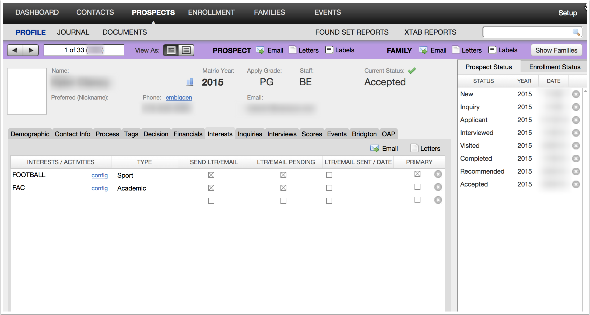
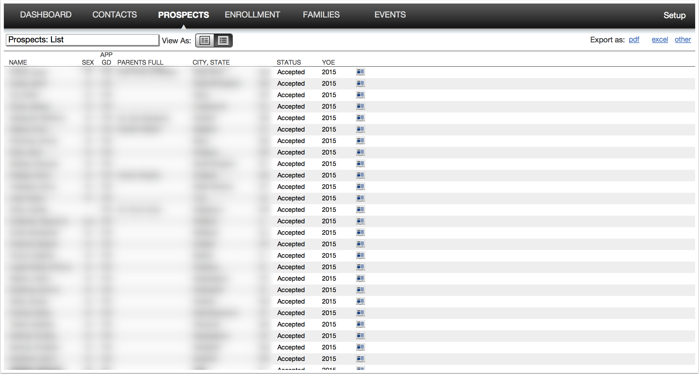
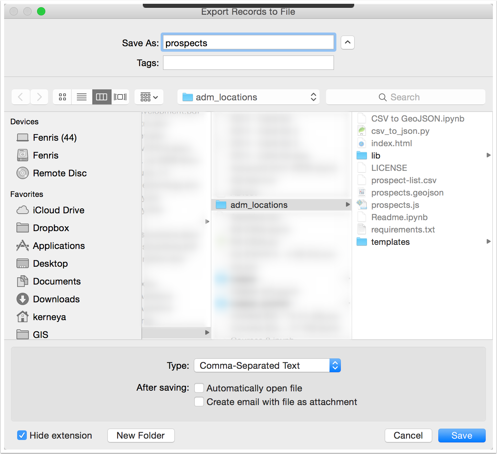
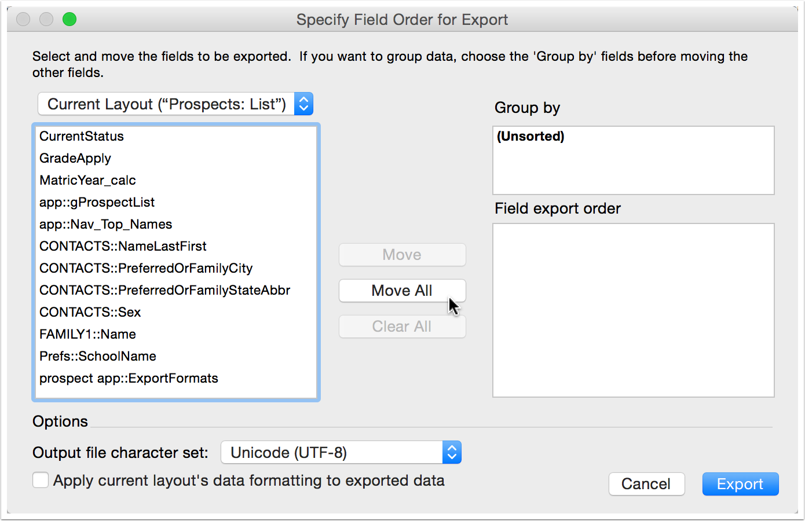
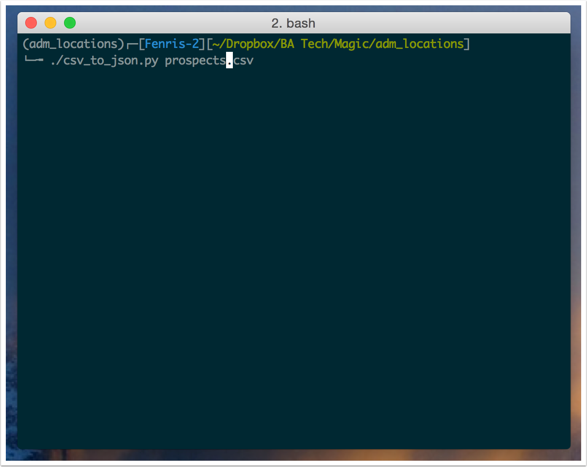
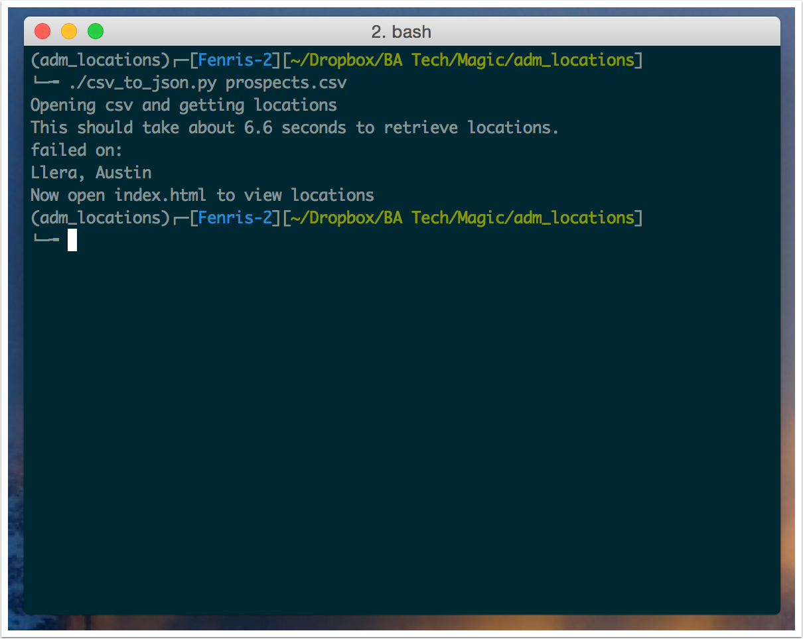
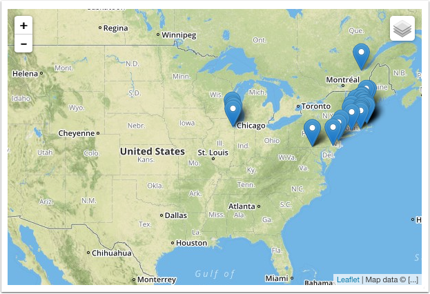

adm\_locations
==============

Designed to work with `Proof
Admissions <http://proofgroup.com/AdmissionsTools>`__ for those who are
better at spatial visualization than just reading from a list.

Steps: -
1. Within Proof adm filter down a set to just the records that you
are interested in. |image0|
2. Then select to view as list, and export as
other |image1|
3. Choose Comma-Seperated Text and place in the same
directory as the script |image2|
4. Move all the fields to the export,
and in the default order |image3|
5. Then within your terminal run
``./csv_to_json.py filename.csv`` using the filename that you just saved
it as. |image5|
6. The script will give an estimated time to completion, and display which
people it failed to find a location for. |image6|
7. It will try to open a browser window with the page, otherwise open
``index.html`` to view the locations. |image7|

